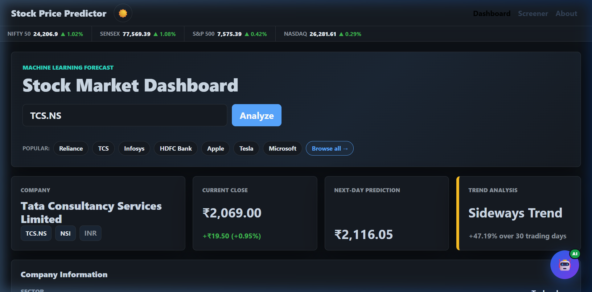
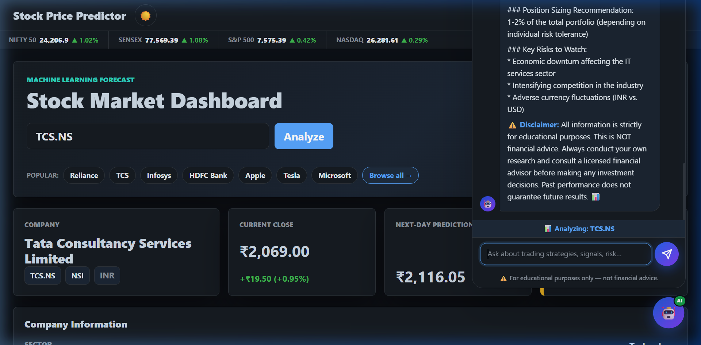
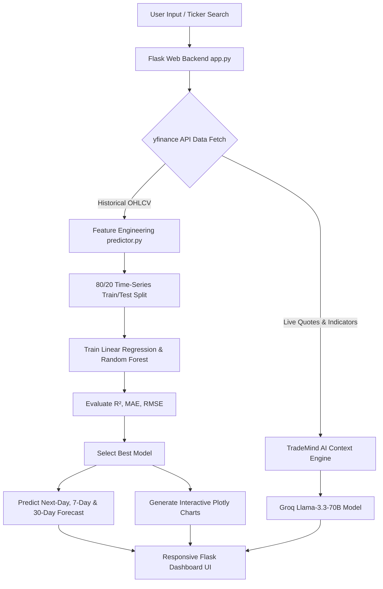

# 📈 TradeMind: Stock Price Predictor & AI Trading Assistant

[](https://python.org)
[](https://flask.palletsprojects.com)
[](https://scikit-learn.org)
[](https://plotly.com)
[](https://groq.com)
[](LICENSE)

An intelligent, full-stack stock market forecasting dashboard powered by **Supervised Machine Learning** (Scikit-Learn) and integrated with **TradeMind AI**—a context-aware trading assistant capable of running live technical analysis queries directly on Yahoo Finance market data.

---

## 🌟 Core Visuals

### 1. Dynamic Currency Dashboard (Multi-Market & Indian Rupee Support)
The dashboard dynamically formats pricing, historical bounds, and predictions based on the stock's listing exchange currency (e.g., `₹` for NSE/BSE and `$` for NASDAQ/NYSE).



---

### 2. TradeMind AI Chatbot (Live Technical Analysis & Indicator Calculations)
The floating AI chatbot automatically detects stock tickers, fetches historical data via Yahoo Finance, calculates indicators on-the-fly (**14-period RSI, MACD, 50/200-day Moving Averages, Golden/Death Crosses**), and delivers actionable trading analysis.



---

## ✨ Features

### 📊 Multi-Model ML Forecasting Engine
- **Automated Pipeline Training**: Trains both **Linear Regression** and **Random Forest Regressor** pipelines using `StandardScaler` feature normalization.
- **Time-Ordered Sequential Split**: Evaluates models on an 80/20 chronological train/test split to prevent future data leakage.
- **Dynamic Model Selection**: Automatically selects the best-performing model based on validation **$R^2$ Score**.
- **Model Performance Metrics**: Displays **$R^2$ Score, Mean Absolute Error (MAE), and Root Mean Squared Error (RMSE)** for complete transparency.
- **Multi-Horizon Predictions**: Predicts the **Next-day closing price**, **7-day trend forecast**, and **30-day projected price trajectory** via iterative forecasting.

### 💬 Smart Trading Assistant (TradeMind AI)
- **Groq LLM Integration**: Powered by `llama-3.3-70b-versatile` via the official Groq SDK.
- **Selective Context Matching**: Generates friendly conversational replies for general greetings ("hi", "hello"), while automatically attaching live stock metrics when market questions or specific tickers are queried.
- **Technical Analysis Parser**: On-the-fly calculation of **14-day RSI**, **MACD signal line crossovers**, **50-day and 200-day SMAs** (Golden Cross & Death Cross detection), and **52-week high/low ranges**.

### 📈 Interactive Plotly Visualizations
- **Historical Candlestick & Volume Chart**: Interactive price action with embedded trading volume bars.
- **Actual vs. Predicted Model Fit**: Overlay comparison plot evaluating historical test data against model forecasts.
- **Moving Average Overlays**: 50-Day and 200-Day Simple Moving Average trendlines.
- **30-Day Future Forecast Curve**: Projected price path visualizer.

### 📊 Live Market Screener & Major Indices Ticker
- **Market Screener**: Batch real-time price tracker for **Nifty 50** (Indian Stock Market) and **US 30** (Dow Jones) watchlists.
- **Live Major Indices Bar**: Sticky header bar providing live quotes and percentage changes for **NIFTY 50**, **SENSEX**, **S&P 500**, and **NASDAQ**.

### ⚡ Additional Highlights
- **Live Stock Updates & News**: Real-time price refresh and ticker-specific news headlines feed.
- **Ticker Autocomplete Search**: Intelligent search bar with instant autocomplete suggestions from a structured stock database.
- **Dark/Light Theme Toggle**: Full dark mode support with client-side `localStorage` state persistence.

---

## 🏗️ System Architecture & Data Flow



---

## 🛠️ Tech Stack

| Category | Technology | Usage / Description |
| :--- | :--- | :--- |
| **Backend** | Python 3.10+, Flask 3.0+ | Server routing, REST API endpoints, Jinja2 template rendering |
| **Frontend** | HTML5, Vanilla CSS3, Bootstrap 5, ES6 JavaScript | Responsive UI layout, async fetch API, interactive theme toggle |
| **Data & Processing** | Pandas, NumPy | Time-series data manipulation, feature generation, technical indicators |
| **Machine Learning** | Scikit-Learn | `StandardScaler`, `LinearRegression`, `RandomForestRegressor`, evaluation metrics |
| **Data Retrieval** | yfinance | Downloading live & historical Yahoo Finance stock market data |
| **AI LLM Engine** | Groq SDK (`llama-3.3-70b-versatile`) | Context-aware AI stock analyst and conversational trading bot |
| **Data Visualization** | Plotly.js / Plotly Python | Interactive candlestick, volume, moving average, and forecast charts |
| **Environment Management**| `python-dotenv` | Secure environment variable configuration |

---

## 📂 Project Directory Structure

```text
Stock-Price-Predictor/
├── .env                       # Environment variables (GROQ_API_KEY)
├── app.py                     # Main Flask application, routes & Groq AI integration
├── predictor.py               # Feature engineering, ML training pipeline & Plotly charts
├── requirements.txt           # Project Python dependencies
├── stock_data.csv             # Cached historical stock data CSV
├── README.md                  # Comprehensive project documentation
├── models/                    # Directory for persisted ML model binaries
├── static/
│   ├── css/
│   │   └── style.css          # Custom styling, dark/light theme tokens, card layouts
│   ├── data/
│   │   └── stocks.json        # Predefined watchlists (Nifty 50 and US 30 tickers)
│   ├── images/
│   │   ├── dashboard_inr.png  # Dashboard UI screenshot with INR currency formatting
│   │   └── chatbot_analysis.png # Chatbot UI screenshot showing technical analysis
│   └── js/
│       ├── chatbot.js         # Floating AI chatbot UI state & chat interaction logic
│       ├── dashboard.js       # Chart initialization, theme switching & live updates
│       └── screener.js        # Market screener table batch-rendering & filtering
└── templates/
    ├── about.html             # Internship project information & tech breakdown page
    ├── index.html             # Core interactive dashboard template
    └── screener.html          # Nifty 50 & US 30 market screener page
```

---

## ⚡ API Reference

| Endpoint | Method | Description |
| :--- | :--- | :--- |
| `/` | `GET`, `POST` | Primary Stock Predictor Dashboard & model analysis |
| `/screener` | `GET` | Market Screener interface for Nifty 50 and US 30 |
| `/about` | `GET` | About & project details page |
| `POST /api/chat` | `POST` | TradeMind AI assistant endpoint (Groq LLM + Yahoo Finance context) |
| `GET /api/stock-update` | `GET` | Lightweight live stock price, percentage change, and news feed |
| `GET /api/screener-data` | `GET` | Batch quote fetcher for market screener watchlists (`?list=nifty50` or `us30`) |
| `GET /api/market-indices` | `GET` | Live quote fetcher for major market indices (Nifty 50, Sensex, S&P 500, Nasdaq) |
| `GET /api/search` | `GET` | Autocomplete ticker query endpoint (`?q=symbol`) |

---

## 🚀 Installation & Local Setup

### 1. Prerequisites
- **Python**: Version 3.10 or higher
- **Groq API Key**: (Optional but recommended) Get a free key at [console.groq.com](https://console.groq.com)

### 2. Clone the Repository & Navigate
```powershell
cd "task 1/Stock-Price-Predictor"
```

### 3. Create & Activate Virtual Environment
**Windows (PowerShell):**
```powershell
python -m venv venv
.\venv\Scripts\activate
```

**macOS / Linux:**
```bash
python -m venv venv
source venv/bin/activate
```

### 4. Install Dependencies
```powershell
pip install -r requirements.txt
```

### 5. Configure Environment Variables
Create a `.env` file in the root directory (`Stock-Price-Predictor/.env`) and insert your Groq API key:
```env
GROQ_API_KEY=gsk_your_actual_groq_api_key_here
```
*(Note: If `GROQ_API_KEY` is omitted, TradeMind AI automatically operates in a rule-based fallback mode.)*

### 6. Launch the Application
```powershell
python app.py
```

Open your browser and navigate to:
👉 **[http://127.0.0.1:5000](http://127.0.0.1:5000)**

---

## 🧠 Machine Learning Methodology

### 1. Feature Engineering
The raw daily OHLCV series is transformed into a rich tabular dataset:
- **Lagged Price**: Previous day's closing price (`Prev_Close`).
- **Simple Moving Averages**: 5, 10, 20, 50, and 200-day SMAs.
- **Momentum & Volatility**: 1-Day Percentage Return (`Return_1D`), 5-Day Rolling Volatility (`Volatility_5`).
- **Price Spread**: Normalized daily range (`(High - Low) / Close`).

### 2. Sequential Train / Test Split
To mirror real-world market forecasting, the dataset is split chronologically:
- **Training Set**: Chronological initial 80% of historical data.
- **Testing Set**: Most recent 20% of historical data.
*Standard random cross-validation is intentionally avoided to prevent future data leakage.*

### 3. Model Selection & Forecasting
1. **Pipeline Execution**: Trains both `LinearRegression` and `RandomForestRegressor` with feature scaling (`StandardScaler`).
2. **Evaluation Metrics**: Models are compared using validation $R^2$ Score.
3. **Best Model Selection**: The model with the higher $R^2$ score is selected to produce predictions.
4. **Iterative Multi-Step Projection**: The 7-day and 30-day forecasts are built recursively step-by-step, recalculating derived moving averages and volatility features after each projected day.

---

## ⚠️ Disclaimer
This application is created strictly for **educational and academic demonstration purposes**. Stock market forecasting involves inherent financial risk. This tool does **not** constitute financial advice, trading recommendations, or investment advice. Always perform independent research and consult a licensed financial advisor before making investment decisions.

---

## 📜 License
Distributed under the **MIT License**. See `LICENSE` for more information.
